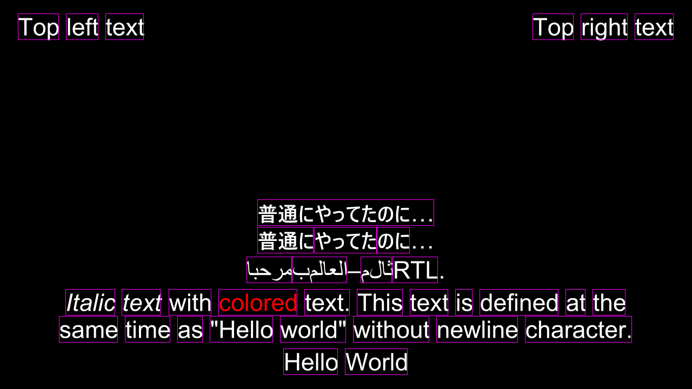

Summary of Changes  
Iterates over the glyphs in visual order to finalize word when encountering space.  
Outputs each word text and position.  
For scripts where “word” is ambiguous (e.g. Japanese), manual word boundaries (via explicit tags) are necessary.  
Added new explicit word boundary tag ({\wb}).  

Output example:

Extracted 6 events with word positions:

Event 0 stripped text: Hello World  
  Word: 'Hello' at (524,645) size 101x49  
  Word: 'World' at (638,645) size 116x49  

  Event 1 stripped text: Italic text with colored text. This text is defined at the same time as "Hello world" without newline character.  
  Word: 'Italic' at (121,535) size 92x49
  Word: 'text' at (225,535) size 72x49
  Word: 'with' at (312,535) size 79x49
  Word: 'colored' at (404,535) size 146x49
  Word: 'text.' at (563,535) size 84x49
  Word: 'This' at (660,535) size 85x49
  Word: 'text' at (758,535) size 71x49
  Word: 'is' at (842,535) size 32x49
  Word: 'defined' at (887,535) size 146x49
  Word: 'at' at (1046,535) size 37x49
  Word: 'the' at (1096,535) size 61x49
  Word: 'same' at (109,585) size 109x49
  Word: 'time' at (231,585) size 84x49
  Word: 'as' at (328,585) size 47x49
  Word: '"Hello' at (388,585) size 117x49
  Word: 'world"' at (518,585) size 122x49
  Word: 'without' at (653,585) size 141x49
  Word: 'newline' at (807,585) size 151x49
  Word: 'character.' at (971,585) size 198x49  

Event 2 stripped text: Top left text  
  Word: 'Top' at (33,25) size 76x49
  Word: 'left' at (122,25) size 60x49
  Word: 'text' at (195,25) size 71x49  

Event 3 stripped text: Top right text  
  Word: 'Top' at (985,25) size 76x49
  Word: 'right' at (1074,25) size 87x49
  Word: 'text' at (1174,25) size 72x49  

Event 4 stripped text: مرحبابالعالم–مثالRTL.  
  Word: 'ابحرم' at (456,475) size 84x49
  Word: 'بملاعلا' at (540,475) size 102x49
  Word: '–' at (643,475) size 0x49
  Word: 'ملاث' at (667,475) size 58x49
  Word: 'RTL' at (726,475) size 84x49
  Word: '.' at (811,475) size 0x49  

Event 5 stripped text: 普通にやってたのに…\N普通にやってたのに…  
  Word: '普通にやってたのに…' at (476,369) size 327x49  
  Word: '普通に' at (476,420) size 104x49
  Word: 'やってた' at (581,420) size 116x49
  Word: 'のに' at (697,420) size 61x49
  Word: '…' at (759,420) size 0x49

Notes:  
BRAILLE PATTERN BLANK "⠀" for connecting spaces to words  
U+2800

Zero-width-space "​​​​" works as alternative to {\wb} tag.  
U+200B

Stripped text still contains "\N" new line character  
Dialogue: 0,0:00:00.00,0:00:10.00,Default,,0,0,0,,{\pos(320,240)}{\fs20}かん{\fs25}\N​漢 // Event n stripped text: "かん\N漢"